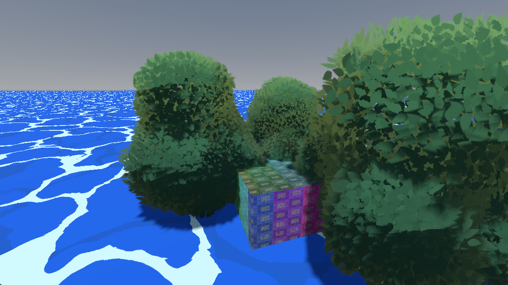

# Godot-Standard-Assets

Note: Welcome early visitor, this project has just been started! Come back soon!

A collection of freely usable art, scripts, and sounds that will benefit many projects.

## License

Most content is either MIT or cc0. Please see license.txt files in their respective folders for more information.

#### CC0 creators:
	
	FlynnCat: https://flynncat.itch.io/mrd-terrain
	Kenney: https://kenney.itch.io/

#### CC-BY creators:
	
The water shader is originally by Polyflare
	License: CC-BY 4.0
	URL: https://creativecommons.org/licenses/by/4.0/
