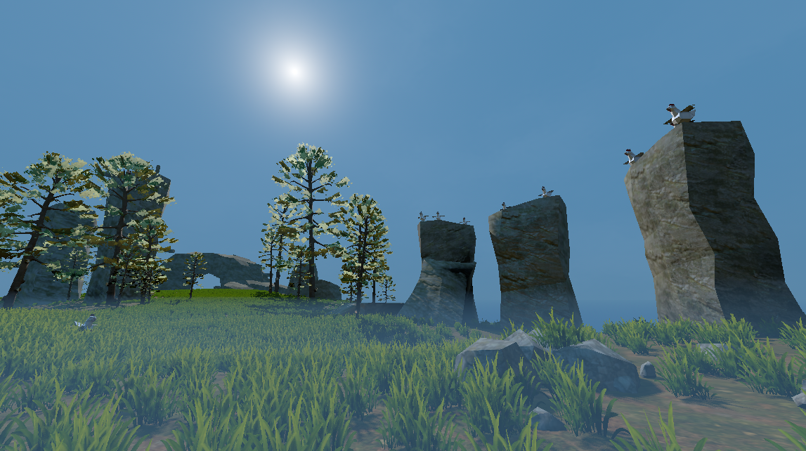

# Uber Godot Game Jam Kit

## Welcome early visitor

This project has just been started! Come back soon!

## Introduction

This repository is a collection of freely usable art, scripts, and sounds that hopes to benefit many projects.

This project is currently empty, though the project.godot file contains the input map, layer definition, and other project related information. This project serves as a base for addons. 

Please see the ./Scene/ folder for examples.

## Installation

Simply type,

`git clone https://github.com/sci-comp/UberGodotGameJamKit`

or use Github Desktop. By cloning, submodules will automatically be included.

### Submodules

Links to submobule repositories,

- EditorToolbox  [link](https://github.com/sci-comp/EditorToolbox)
- StandardAssets  [link](https://github.com/sci-comp/StandardAssets)

### Adding and Removing Submodules

Although the Uber Godot Game Jam Kit already has submodules added, you will need to add them yourself if you start from a new project. The following commands serve as helpful reminders.

Note for Github Desktop users: Github Desktop cannot add or remove submodules. However, once a submodule has been added through the console, we can manage it from within the Github Desktop UI.

We can add submodules with,

	- git submodule add --force https://github.com/sci-comp/ExampleSubmodule addons/ExampleSubmodule
	- git submodule init
	- git submodule update

We remove submodules with,

	- git submodule deinit -f addons/ExampleSubmodule
	- git rm --cached addons/ExampleSubmodule
	- rm -r addons/ExampleSubmodule

If you delete a submodule without first calling submodule deinit, which is an easy mistake to make, then we have to manully remove the submodule references in the following locations,

	- ./.git/config
	- ./.git/modules/

## License

Most content is either MIT or cc0. Please see license.txt files in their respective folders for more information. 

A summary of all content is included below,

#### CC0 content
	
	FlynnCat: https://flynncat.itch.io/mrd-terrain
	Kenney: https://kenney.itch.io/
	Sound files by FilmCow

#### CC-BY content

The water shader is originally by Polyflare
	License: CC-BY 4.0
	URL: https://creativecommons.org/licenses/by/4.0/

#### MIT content

	The third person controller is from (note: this is temporary!): https://github.com/selgesel/godot4-third-person-controller
	The lookup tables for color grading come from this project: https://github.com/thiagoamendola/godot-color-lut-shader
